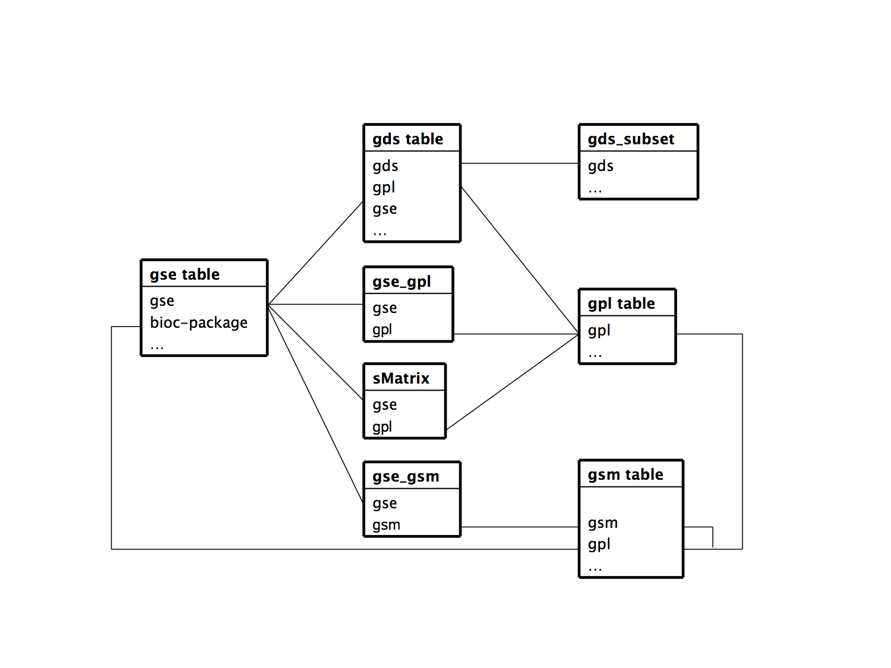

<!--
%\VignetteEngine{knitr::rmarkdown}
%\VignetteIndexEntry{GEOmetadb}
%\VignetteDepends{GEOmetadb}
%\VignetteKeywords{GEOmetadb}
%\VignetteKeywords{GEOmetadb}
%\VignettePackage{GEOmetadb}
-->
# Overview of *GEOmetadb*

The NCBI Gene Expression Omnibus (GEO) represents the largest repository of microarray data in existence.  One difficulty in dealing with GEO is finding the microarray data that is of interest.  As part of the NCBI Entrez search system, GEO can be searched online via web pages or using NCBI Eutils.  However, the web search is not as full-featured as it could be, particularly for programmatic access.  NCBI Eutils offers another option for finding data within the vast stores of GEO, but it is cumbersome to use, often requiring multiple complicated Eutils calls to get at the relevant information.  We have found it **absolutely critical** to have ready access not just to the microarray data, but to the metadata describing the microarray experiments.  To this end we have created *GEOmetadb*.

## What is *GEOmetadb*?

The *GEOmetadb* package is an attempt to make querying the metadata describing microarray experiments, platforms, and datasets both easier and more powerful.  At the heart of *GEOmetadb* is a SQLite database that stores nearly all the metadata associated with all GEO data types including GEO samples (GSM), GEO platforms (GPL), GEO data series (GSE), and curated GEO datasets (GDS), as well as the relationships between these data types.  This database is generated by our server by parsing all the records in GEO and needs to be downloaded via a simple helper function to the user's local machine before *GEOmetadb* is useful.  Once this is done, the entire GEO database is accessible with simple SQL-based queries.  With the GEOmetadb database, queries that are simply not possible using NCBI tools or web pages are often quite simple.

The relationships between the tables in the GEOmetadb SQLite database can be seen in the following *entity-relationship diagram*.




## Conversion capabilities

A very typical problem for large-scale consumers of GEO data is to determine the relationships between various GEO accession types.  As examples, consider the following questions:

* What samples are associated with GEO platform "GPL96", which represents the Affymetrix hgu133a array?}
* What GEO Series were performed using GPL96?
* What samples are in my favorite three GEO Series records?
* How many samples are associated with the ten most popular GEO platforms?

Because these types of questions are common, *GEOmetadb* contains the function `geoConvert` that addresses these questions directly and efficiently.

## What *GEOmetadb* is not

We have faithfully parsed and maintained in GEO when creating *GEOmetadb*.  This means that limitations inherent to GEO are also inherent in *GEOmetadb*.  We have made no attempt to curate, semantically recode, or otherwise "clean up"" GEO; to do so would require significant resources, which we do not have. 

*GEOmetadb* does not contain any microarray data.  For access to microarray data from within R/Bioconductor, please look at the *GEOquery* package.  In fact, we would expect that many users will find that the combination of *GEOmetadb* and *GEOquery* is quite powerful.

```{r include=FALSE}
library(knitr)
options(width=55)
opts_chunk$set(cache=TRUE,message=FALSE,warning=FALSE)
```

# Getting Started

Once *GEOmetadb* is installed (see the Bioconductor website for full installation instructions), we are ready to begin.

## Getting the *GEOmetadb* database

This package does not come with a pre-installed version of the database.  This has the advantage that the user will get the most up-to-date version of the database to start; the database can be re-downloaded using the same command as often as desired.  First, load the library.

```{r}
library(GEOmetadb)
``` 

The download and uncompress steps are done automatically with a single command, `getSQLiteFile`.
```{r}
if(!file.exists('GEOmetadb.sqlite')) getSQLiteFile()
``` 

The default storage location is in the current working directory and the default filename is "GEOmetadb.sqlite"; it is best to leave the name unchanged unless there is a pressing reason to change it.

Since this SQLite file is of key importance in *GEOmetadb*, it is perhaps of some interest to know some details about the file itself.

```{r}
file.info('GEOmetadb.sqlite')
``` 

Now, the SQLite file is available for connection.  The standard *DBI* functionality as implemented in *RSQLite* function `dbConnect` makes the connection to the database.  The `dbDisconnect` function disconnects the connection.

```{r}
con <- dbConnect(SQLite(),'GEOmetadb.sqlite')
dbDisconnect(con)
``` 

The variable `con` is an *RSQLite* connection object.

## A word about SQL

The Structured Query Language, or SQL, is a very powerful and standard way of working with relational data.  GEO is composed of several data types, all of which are related to each other; in fact, NCBI uses a relational SQL database for metadata storage and querying.  SQL databases and SQL itself are designed specifically to work efficiently with just such data.  While the goal of many programming projects and programmers is to hide the details of SQL from the user, we are of the opinion that such efforts may be counterproductive, particularly with complex data and the need for *ad hoc* queries, both of which are characteristics with GEO metadata.  We have taken the view that exposing the power of SQL will enable users to maximally utilize the vast data repository that is GEO.  We understand that many users are not accustomed to working with SQL and, therefore, have devoted a large section of the vignette to working examples.  Our goal is not to teach SQL, so a quick tutorial of SQL is likely to be beneficial to those who have not used it before.  Many such tutorials are available online and can be completed in 30 minutes or less.  

# Examples

## Interacting with the database

The functionality covered in this section is covered in much more detail in the *DBI* and *RSQLite* package documentation.  We cover enough here only to be useful.  

Again, we connect to the database.

```{r}
con <- dbConnect(SQLite(),'GEOmetadb.sqlite')
``` 

The `dbListTables` function lists all the tables in the SQLite database handled by the connection object `con`.  

```{r}
geo_tables <- dbListTables(con)
geo_tables
``` 

There is also the `dbListFields` function that can list database fields associated with a table.  

```{r}
dbListFields(con,'gse')
``` 

Sometimes it is useful to get the actual SQL schema associated with a table.  As an example of doing this and using an *RSQLite* shortcut function, `sqliteQuickSQL`, we can get the table schema for the `gpl` table.

```{r}
sqliteQuickSQL(con,'PRAGMA TABLE_INFO(gpl)')
``` 

## Writing SQL queries and getting results

Select 5 records from the *gse* table and show the first 7 columns.

```{r}
rs <- dbGetQuery(con,'select * from gse limit 5')
rs[,1:7]
``` 

Get the GEO series accession and title from GEO series that were submitted by "Sean Davis".  The "%" sign is used in combination with the "like" operator to do a "wildcard" search for the name "Sean Davis" with any number of characters before or after or between "Sean" and "Davis".

```{r}
rs <- dbGetQuery(con,paste("select gse,title from gse where",
                           "contributor like '%Sean%Davis%'",sep=" "))
rs
``` 

As another example, GEOmetadb can find all samples on GPL96 (Affymetrix hgu133a) that have .CEL files available for download.

```{r}
rs <- dbGetQuery(con,paste("select gsm,supplementary_file",
                           "from gsm where gpl='GPL96'",
                           "and supplementary_file like '%CEL.gz'"))
dim(rs)
``` 

But why limit to only GPL96?  Why not look for all Affymetrix arrays that have .CEL files?  And list those with their associated GPL information, as well as the Bioconductor annotation package name?

```{r}
rs <- dbGetQuery(con,paste("select gpl.bioc_package,gsm.gpl,",
                           "gsm,gsm.supplementary_file",
                           "from gsm join gpl on gsm.gpl=gpl.gpl",
                           "where gpl.manufacturer='Affymetrix'",
                           "and gsm.supplementary_file like '%CEL.gz' "))
rs[1:5,]
``` 

Of course, we can combine programming and data access.  A simple `sapply` example shows how to query each of the tables for number of records.  

```{r}
getTableCounts <- function(tableName,conn) {
  sql <- sprintf("select count(*) from %s",tableName)
  return(dbGetQuery(conn,sql)[1,1])
}
do.call(rbind,sapply(geo_tables,getTableCounts,con,simplify=FALSE))
``` 


## Conversion of GEO entity types

Large-scale consumers of GEO data might want to convert GEO entity type from one to others, e.g. finding all GSM and  GSE associated with 'GPL96'. Function goeConvert does the conversion with a very fast mapping between entity types. 

Covert 'GPL96' to other possible types in the GEOmetadb.sqlite.

```{r}
conversion <- geoConvert('GPL96')
``` 


Check what GEO types and how many entities in each type in the conversion.

```{r}
lapply(conversion, dim)
conversion$gse[1:5,]
conversion$gsm[1:5,]
conversion$gds[1:5,]
conversion$sMatrix[1:5,]
```    

## Mappings between GPL and Bioconductor microarry annotation packages

The function getBiocPlatformMap is to get GPL information of a given list of Bioconductor microarry annotation packages. Note currently the GEOmetadb does not contains all the mappings, but we are trying to construct a relative complete list.   

Get GPL information of 'hgu133a' and 'hgu95av2':

```{r}
getBiocPlatformMap(con, bioc=c('hgu133a','hgu95av2'))
```


## More advanced queries

Now, for something a bit more complicated, we would like to find all the human breast cancer-related Affymetrix gene expression GEO series.

```{r}
sql <- paste("SELECT DISTINCT gse.title,gse.gse",
             "FROM",
             "  gsm JOIN gse_gsm ON gsm.gsm=gse_gsm.gsm",
             "  JOIN gse ON gse_gsm.gse=gse.gse",
             "  JOIN gse_gpl ON gse_gpl.gse=gse.gse",
             "  JOIN gpl ON gse_gpl.gpl=gpl.gpl",
             "WHERE",
             "  gsm.molecule_ch1 like '%total RNA%' AND",
             "  gse.title LIKE '%breast cancer%' AND",
             "  gpl.organism LIKE '%Homo sapiens%'",sep=" ")
rs <- dbGetQuery(con,sql)
dim(rs)
print(rs[1:5,],right=FALSE)
``` 


## A wordcloud of GSE titles

Since we have all the data from NCBI GEO available, why not look around a bit.  The next code block creates a wordcloud using the *tm* and *wordcloud* packages based on the titles of all GSE records.

```{r fig.width=10}
library(tm)
library(wordcloud)
gseTitles = dbGetQuery(con,"select title from gse")
corp = VCorpus(VectorSource(gseTitles))
corp <- tm_map(corp, removePunctuation)
corp <- tm_map(corp, content_transformer(tolower))
corp <- tm_map(corp, removeNumbers)
corp <- tm_map(corp, function(x)removeWords(x,stopwords()))
term.matrix <- TermDocumentMatrix(corp)
term.matrix <- as.matrix(term.matrix)
v <- sort(rowSums(term.matrix),decreasing=TRUE)
d <- data.frame(word = names(v),freq=v)
n = 100
wordcloud(d[1:n,]$word,d[1:n,]$freq)
```

## Using dplyr with GEOmetadb

The [dplyr package](http://cran.rstudio.com/web/packages/dplyr/) provides a very streamlined functional approach to [accessing SQL databases](http://cran.rstudio.com/web/packages/dplyr/vignettes/databases.html). 

Load the *dplyr* library and connect to the `GEOmetadb.sqlite` database.  The *dplyr* package is written around manipulation of tabular data, so we will work with only one GEOmetadb table, the `gse` table. Instead of using SQL, we can use *dplyr* verbs to get information from tables of interest.

```{r}
library(dplyr)
db = src_sqlite('vignettes/GEOmetadb.sqlite')
gse = tbl(db,'gse')
filter(gse,gse=='GSE2553')
```


## Cleanup

Finally, it is probably a good idea to close the connection. Please see the *DBI* package for details on this point.

```{r}
dbDisconnect(con)
```

If you want to remove old  GEOmetadb.sqlite file before retrieve a new version from the server, execute the following codes:

```{r}
#file.remove('GEOmetadb.sqlite')
```
